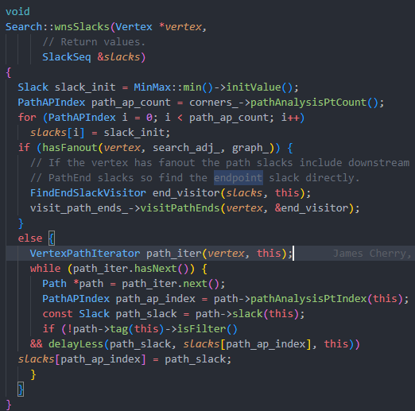

# Repair Setup

## ibex

```bash
   Iter   | Removed | Resized | Inserted | Cloned |  Pin  |    WNS   |   TNS      |  Viol  | Worst
          | Buffers |  Gates  | Buffers  |  Gates | Swaps |          |            | Endpts | Endpt
---------------------------------------------------------------------------------------------------
        0 |       0 |       0 |        0 |      0 |     0 |   -0.332 |     -124.9 |    772 | instr_addr_o[31]
        1 |       0 |       0 |        0 |      0 |     0 |   -0.332 |     -124.9 |    772 | instr_addr_o[31]
iter:1, pass:1, current fixing endpoint: instr_addr_o[31], endpoint slack:-3.3201109e-10
        2 |       0 |       0 |        0 |      0 |     1 |   -0.321 |     -124.5 |    772 | instr_addr_o[31]
iter:2, pass:2, current fixing endpoint: instr_addr_o[31], endpoint slack:-3.206604e-10
        3 |       0 |       0 |        0 |      0 |     2 |   -0.326 |     -124.5 |    772 | instr_addr_o[31]
iter:3, pass:3, current fixing endpoint: instr_addr_o[31], endpoint slack:-3.2594838e-10
        4 |       0 |       1 |        0 |      0 |     2 |   -0.325 |     -124.5 |    772 | instr_addr_o[31]
iter:4, pass:4, current fixing endpoint: instr_addr_o[31], endpoint slack:-3.248084e-10
        5 |       0 |       1 |        0 |      0 |     3 |   -0.318 |     -124.5 |    772 | gen_regfile_ff.register_file_i.rf_reg_q\[510\]$_DFFE_PN0P_/D
iter:5, pass:5, current fixing endpoint: gen_regfile_ff.register_file_i.rf_reg_q\[510\]$_DFFE_PN0P_/D, endpoint slack:-3.175391e-10
        6 |       0 |       1 |        0 |      0 |     4 |   -0.317 |     -123.6 |    772 | gen_regfile_ff.register_file_i.rf_reg_q\[510\]$_DFFE_PN0P_/D
iter:6, pass:6, current fixing endpoint: gen_regfile_ff.register_file_i.rf_reg_q\[510\]$_DFFE_PN0P_/D, endpoint slack:-3.1747316e-10
        7 |       0 |       1 |        0 |      0 |     5 |   -0.317 |     -121.0 |    772 | instr_addr_o[31]
---------------------------------------------------------------------------------------------------------------
iter:7, pass:7, current fixing endpoint: instr_addr_o[31], endpoint slack:-3.174072e-10
        8 |       0 |       1 |        0 |      0 |     6 |   -0.322 |     -121.1 |    772 | instr_addr_o[31]
iter:8, pass:8, current fixing endpoint: instr_addr_o[31], endpoint slack:-3.2169267e-10
        9 |       0 |       1 |        2 |      0 |     6 |   -0.334 |     -121.5 |    772 | instr_addr_o[31]
iter:9, pass:9, current fixing endpoint: instr_addr_o[31], endpoint slack:-3.338061e-10
       10 |       0 |       1 |        2 |      0 |     7 |   -0.339 |     -121.5 |    772 | instr_addr_o[31]
iter:10, pass:10, current fixing endpoint: instr_addr_o[31], endpoint slack:-3.3941006e-10
       11 |       0 |       1 |        2 |      0 |     8 |   -0.339 |     -121.5 |    772 | instr_addr_o[31]
iter:11, pass:11, current fixing endpoint: instr_addr_o[31], endpoint slack:-3.3890157e-10
       12 |       0 |       1 |        2 |      0 |     9 |   -0.337 |     -121.4 |    772 | instr_addr_o[31]
iter:12, pass:12, current fixing endpoint: instr_addr_o[31], endpoint slack:-3.3686232e-10
       13 |       0 |       1 |        4 |      0 |     9 |   -0.335 |     -121.4 |    772 | instr_addr_o[31]
iter:13, pass:13, current fixing endpoint: instr_addr_o[31], endpoint slack:-3.350158e-10
       14 |       0 |       2 |        4 |      0 |     9 |   -0.331 |     -121.3 |    772 | instr_addr_o[31]
iter:14, pass:14, current fixing endpoint: instr_addr_o[31], endpoint slack:-3.308951e-10
       15 |       1 |       2 |        4 |      0 |     9 |   -0.330 |     -121.3 |    772 | instr_addr_o[31]
iter:15, pass:15, current fixing endpoint: instr_addr_o[31], endpoint slack:-3.295495e-10
       16 |       1 |       2 |        4 |      0 |    10 |   -0.338 |     -121.6 |    772 | instr_addr_o[31]
iter:16, pass:16, current fixing endpoint: instr_addr_o[31], endpoint slack:-3.382905e-10
       17 |       1 |       2 |        4 |      0 |    11 |   -0.338 |     -121.6 |    772 | instr_addr_o[31]
iter:17, pass:17, current fixing endpoint: instr_addr_o[31], endpoint slack:-3.382732e-10
       18 |       1 |       2 |        7 |      0 |    11 |   -0.331 |     -121.3 |    772 | instr_addr_o[31]
iter:18, pass:18, current fixing endpoint: instr_addr_o[31], endpoint slack:-3.3118863e-10
       19 |       1 |       3 |        7 |      0 |    11 |   -0.328 |     -121.3 |    772 | instr_addr_o[31]
iter:19, pass:19, current fixing endpoint: instr_addr_o[31], endpoint slack:-3.2784286e-10
       20 |       1 |       3 |        7 |      0 |    12 |   -0.325 |     -121.3 |    772 | instr_addr_o[31]
iter:20, pass:20, current fixing endpoint: instr_addr_o[31], endpoint slack:-3.2491543e-10
       21 |       1 |       3 |        7 |      0 |    13 |   -0.337 |     -121.4 |    772 | instr_addr_o[31]
iter:21, pass:21, current fixing endpoint: instr_addr_o[31], endpoint slack:-3.3686853e-10
       22 |       1 |       3 |        9 |      0 |    13 |   -0.336 |     -121.4 |    772 | instr_addr_o[31]
iter:22, pass:22, current fixing endpoint: instr_addr_o[31], endpoint slack:-3.3615177e-10
       23 |       1 |       3 |       11 |      0 |    13 |   -0.334 |     -121.3 |    772 | instr_addr_o[31]
iter:23, pass:23, current fixing endpoint: instr_addr_o[31], endpoint slack:-3.337275e-10
       24 |       1 |       3 |       11 |      0 |    14 |   -0.336 |     -121.4 |    772 | instr_addr_o[31]
iter:24, pass:24, current fixing endpoint: instr_addr_o[31], endpoint slack:-3.364813e-10
       25 |       1 |       4 |       11 |      0 |    14 |   -0.336 |     -121.3 |    772 | instr_addr_o[31]
iter:25, pass:25, current fixing endpoint: instr_addr_o[31], endpoint slack:-3.356544e-10
       26 |       1 |       4 |       11 |      0 |    15 |   -0.342 |     -121.6 |    772 | instr_addr_o[31]
iter:26, pass:26, current fixing endpoint: instr_addr_o[31], endpoint slack:-3.417966e-10
       27 |       1 |       4 |       13 |      0 |    15 |   -0.343 |     -121.6 |    772 | instr_addr_o[31]
iter:27, pass:27, current fixing endpoint: instr_addr_o[31], endpoint slack:-3.4252357e-10
       28 |       1 |       4 |       13 |      0 |    16 |   -0.347 |     -121.8 |    772 | instr_addr_o[31]
iter:28, pass:28, current fixing endpoint: instr_addr_o[31], endpoint slack:-3.4665448e-10
       29 |       1 |       4 |       13 |      0 |    17 |   -0.346 |     -121.8 |    772 | instr_addr_o[31]
iter:29, pass:29, current fixing endpoint: instr_addr_o[31], endpoint slack:-3.464431e-10
       30 |       1 |       5 |       13 |      0 |    17 |   -0.342 |     -121.6 |    772 | instr_addr_o[31]
iter:30, pass:30, current fixing endpoint: instr_addr_o[31], endpoint slack:-3.4227532e-10
       31 |       1 |       6 |       13 |      0 |    17 |   -0.339 |     -121.5 |    772 | instr_addr_o[31]
iter:31, pass:31, current fixing endpoint: instr_addr_o[31], endpoint slack:-3.390801e-10
       32 |       2 |       6 |       13 |      0 |    17 |   -0.327 |     -121.4 |    772 | instr_addr_o[31]
iter:32, pass:32, current fixing endpoint: instr_addr_o[31], endpoint slack:-3.271705e-10
       33 |       2 |       6 |       13 |      0 |    18 |   -0.327 |     -121.4 |    772 | instr_addr_o[31]
iter:33, pass:33, current fixing endpoint: instr_addr_o[31], endpoint slack:-3.2712744e-10
       34 |       2 |       7 |       13 |      0 |    18 |   -0.325 |     -121.4 |    772 | instr_addr_o[31]
iter:34, pass:34, current fixing endpoint: instr_addr_o[31], endpoint slack:-3.2488123e-10
       35 |       2 |       8 |       13 |      0 |    18 |   -0.321 |     -121.4 |    772 | instr_addr_o[31]
iter:35, pass:35, current fixing endpoint: instr_addr_o[31], endpoint slack:-3.2119907e-10
       36 |       2 |       9 |       13 |      0 |    18 |   -0.324 |     -121.4 |    772 | instr_addr_o[31]
iter:36, pass:36, current fixing endpoint: instr_addr_o[31], endpoint slack:-3.2369663e-10
       37 |       2 |       9 |       13 |      0 |    19 |   -0.325 |     -121.4 |    772 | instr_addr_o[31]
iter:37, pass:37, current fixing endpoint: instr_addr_o[31], endpoint slack:-3.2458813e-10
       38 |       2 |      10 |       13 |      0 |    19 |   -0.324 |     -121.4 |    772 | instr_addr_o[31]
iter:38, pass:38, current fixing endpoint: instr_addr_o[31], endpoint slack:-3.2446046e-10
       39 |       2 |      11 |       13 |      0 |    19 |   -0.323 |     -121.4 |    772 | instr_addr_o[31]
iter:39, pass:39, current fixing endpoint: instr_addr_o[31], endpoint slack:-3.2310865e-10
       40 |       2 |      11 |       13 |      0 |    20 |   -0.326 |     -121.4 |    772 | instr_addr_o[31]
iter:40, pass:40, current fixing endpoint: instr_addr_o[31], endpoint slack:-3.2562486e-10
       41 |       2 |      11 |       13 |      0 |    21 |   -0.342 |     -121.5 |    772 | instr_addr_o[31]
iter:41, pass:41, current fixing endpoint: instr_addr_o[31], endpoint slack:-3.4208525e-10
       42 |       2 |      12 |       13 |      0 |    21 |   -0.339 |     -121.5 |    772 | instr_addr_o[31]
iter:42, pass:42, current fixing endpoint: instr_addr_o[31], endpoint slack:-3.3911784e-10
       43 |       2 |      13 |       13 |      0 |    21 |   -0.340 |     -121.6 |    772 | instr_addr_o[31]
iter:43, pass:43, current fixing endpoint: instr_addr_o[31], endpoint slack:-3.3972114e-10
       44 |       2 |      14 |       13 |      0 |    21 |   -0.336 |     -121.5 |    772 | instr_addr_o[31]
iter:44, pass:44, current fixing endpoint: instr_addr_o[31], endpoint slack:-3.363929e-10
       45 |       2 |      14 |       13 |      0 |    22 |   -0.336 |     -121.4 |    772 | instr_addr_o[31]
iter:45, pass:45, current fixing endpoint: instr_addr_o[31], endpoint slack:-3.3586312e-10
       46 |       2 |      14 |       13 |      0 |    23 |   -0.333 |     -121.4 |    772 | instr_addr_o[31]
iter:46, pass:46, current fixing endpoint: instr_addr_o[31], endpoint slack:-3.3262948e-10
       47 |       2 |      14 |       13 |      0 |    24 |   -0.332 |     -121.4 |    772 | instr_addr_o[31]
iter:47, pass:47, current fixing endpoint: instr_addr_o[31], endpoint slack:-3.323255e-10
       48 |       2 |      14 |       13 |      0 |    25 |   -0.338 |     -121.5 |    772 | instr_addr_o[31]
iter:48, pass:48, current fixing endpoint: instr_addr_o[31], endpoint slack:-3.3804382e-10
       49 |       2 |      14 |       15 |      0 |    25 |   -0.333 |     -123.8 |    772 | instr_addr_o[31]
iter:49, pass:49, current fixing endpoint: instr_addr_o[31], endpoint slack:-3.3280712e-10
       50 |       2 |      15 |       15 |      0 |    25 |   -0.331 |     -123.8 |    772 | instr_addr_o[31]
iter:50, pass:50, current fixing endpoint: instr_addr_o[31], endpoint slack:-3.3131675e-10
       51 |       2 |      15 |       15 |      0 |    26 |   -0.331 |     -123.8 |    772 | instr_addr_o[31]
iter:51, pass:51, current fixing endpoint: instr_addr_o[31], endpoint slack:-3.3083647e-10
       52 |       2 |      15 |       15 |      1 |    26 |   -0.333 |     -123.8 |    772 | instr_addr_o[31]
iter:52, pass:52, current fixing endpoint: instr_addr_o[31], endpoint slack:-3.3285597e-10
       53 |       2 |      16 |       15 |      1 |    26 |   -0.335 |     -123.8 |    772 | instr_addr_o[31]
iter:53, pass:53, current fixing endpoint: instr_addr_o[31], endpoint slack:-3.3463254e-10
       54 |       2 |      17 |       15 |      1 |    26 |   -0.333 |     -123.8 |    772 | instr_addr_o[31]
iter:54, pass:54, current fixing endpoint: instr_addr_o[31], endpoint slack:-3.3268788e-10
       55 |       2 |      18 |       15 |      1 |    26 |   -0.332 |     -123.8 |    772 | instr_addr_o[31]
iter:55, pass:55, current fixing endpoint: instr_addr_o[31], endpoint slack:-3.3167669e-10
       56 |       2 |      19 |       15 |      1 |    26 |   -0.331 |     -123.8 |    772 | instr_addr_o[31]
iter:56, pass:56, current fixing endpoint: instr_addr_o[31], endpoint slack:-3.3102454e-10
       57 |       2 |      20 |       15 |      1 |    26 |   -0.330 |     -123.8 |    772 | instr_addr_o[31]
iter:57, pass:57, current fixing endpoint: instr_addr_o[31], endpoint slack:-3.300087e-10
       57 |       0 |       3 |        7 |      0 |     5 |   -0.318 |     -121.1 |    772 | instr_addr_o[31]
       58 |       0 |       3 |        7 |      0 |     5 |   -0.318 |     -121.1 |    772 | instr_addr_o[31]
```

some changes restored to iteration 5.

## jpeg

```bash
[INFO RSZ-0094] Found 480 endpoints with setup violations.
[INFO RSZ-0099] Repairing 480 out of 480 (100.00%) violating endpoints...
   Iter   | Removed | Resized | Inserted | Cloned |  Pin  |    WNS   |   TNS      |  Viol  | Worst
          | Buffers |  Gates  | Buffers  |  Gates | Swaps |          |            | Endpts | Endpt
---------------------------------------------------------------------------------------------------
        0 |       0 |       0 |        0 |      0 |     0 |   -0.265 |      -59.0 |    480 | fdct_zigzag.dct_mod.dct_block_2.dct_unit_0.macu.mult_res\[16\]$_DFFE_PP_/D
        1 |       0 |       0 |        0 |      0 |     0 |   -0.265 |      -59.0 |    480 | fdct_zigzag.dct_mod.dct_block_2.dct_unit_0.macu.mult_res\[16\]$_DFFE_PP_/D
iter:1, pass:1, current fixing endpoint: fdct_zigzag.dct_mod.dct_block_2.dct_unit_0.macu.mult_res\[16\]$_DFFE_PP_/D, endpoint slack:-2.6522518e-10
        2 |       0 |       1 |        0 |      0 |     0 |   -0.257 |      -58.3 |    480 | fdct_zigzag.dct_mod.dct_block_2.dct_unit_2.macu.mult_res\[18\]$_DFFE_PP_/D
iter:2, pass:2, current fixing endpoint: fdct_zigzag.dct_mod.dct_block_2.dct_unit_2.macu.mult_res\[18\]$_DFFE_PP_/D, endpoint slack:-2.567141e-10
        3 |       0 |       1 |        0 |      0 |     1 |   -0.263 |      -58.3 |    480 | fdct_zigzag.dct_mod.dct_block_2.dct_unit_2.macu.mult_res\[18\]$_DFFE_PP_/D
iter:3, pass:3, current fixing endpoint: fdct_zigzag.dct_mod.dct_block_2.dct_unit_2.macu.mult_res\[18\]$_DFFE_PP_/D, endpoint slack:-2.6272706e-10
        4 |       0 |       1 |        0 |      0 |     2 |   -0.263 |      -58.3 |    480 | fdct_zigzag.dct_mod.dct_block_2.dct_unit_2.macu.mult_res\[18\]$_DFFE_PP_/D
iter:4, pass:4, current fixing endpoint: fdct_zigzag.dct_mod.dct_block_2.dct_unit_2.macu.mult_res\[18\]$_DFFE_PP_/D, endpoint slack:-2.6306324e-10
        5 |       0 |       1 |        0 |      0 |     3 |   -0.265 |      -58.3 |    480 | fdct_zigzag.dct_mod.dct_block_2.dct_unit_2.macu.mult_res\[18\]$_DFFE_PP_/D
iter:5, pass:5, current fixing endpoint: fdct_zigzag.dct_mod.dct_block_2.dct_unit_2.macu.mult_res\[18\]$_DFFE_PP_/D, endpoint slack:-2.645949e-10
        6 |       0 |       1 |        0 |      0 |     4 |   -0.252 |      -58.3 |    480 | fdct_zigzag.dct_mod.dct_block_6.dct_unit_5.macu.mult_res\[18\]$_DFFE_PP_/D
------------------------------------------------------------------------------------------------------------------------------------------------------------------------
iter:6, pass:6, current fixing endpoint: fdct_zigzag.dct_mod.dct_block_6.dct_unit_5.macu.mult_res\[18\]$_DFFE_PP_/D, endpoint slack:-2.5191238e-10
        7 |       0 |       1 |        0 |      0 |     5 |   -0.254 |      -58.3 |    480 | fdct_zigzag.dct_mod.dct_block_6.dct_unit_5.macu.mult_res\[18\]$_DFFE_PP_/D
iter:7, pass:7, current fixing endpoint: fdct_zigzag.dct_mod.dct_block_6.dct_unit_5.macu.mult_res\[18\]$_DFFE_PP_/D, endpoint slack:-2.5393299e-10
        8 |       0 |       1 |        0 |      0 |     6 |   -0.260 |      -58.3 |    480 | fdct_zigzag.dct_mod.dct_block_6.dct_unit_5.macu.mult_res\[18\]$_DFFE_PP_/D
iter:8, pass:8, current fixing endpoint: fdct_zigzag.dct_mod.dct_block_6.dct_unit_5.macu.mult_res\[18\]$_DFFE_PP_/D, endpoint slack:-2.598447e-10
        9 |       0 |       1 |        0 |      0 |     7 |   -0.252 |      -58.3 |    480 | fdct_zigzag.dct_mod.dct_block_6.dct_unit_5.macu.mult_res\[18\]$_DFFE_PP_/D
iter:9, pass:9, current fixing endpoint: fdct_zigzag.dct_mod.dct_block_6.dct_unit_5.macu.mult_res\[18\]$_DFFE_PP_/D, endpoint slack:-2.5211355e-10
       10 |       0 |       1 |        0 |      0 |     8 |   -0.256 |      -58.3 |    480 | fdct_zigzag.dct_mod.dct_block_6.dct_unit_5.macu.mult_res\[18\]$_DFFE_PP_/D
```

dispite no traceback, WNS is still no improvement

## aes

## Nov 1st

1. 在修复完一部分之后，对slack再进行重排，查看是否有improvement --固定iteration数目？
2. 是否对相关的net进行了reroute等操作？--bounding box/ ...
   没有找到具体在哪里更新了dirtyNets_<>，但可以确定每次reroute都会选择受到影响的net进行reroute
3. gui？--
4. net信息？
5. wns到底是net的endpoint还是path的endpoint？
   
   Bookmark
   Search.cc:3211

## Nov 8

1. 保持总iteration数不变
2. DirtyNets的判断条件

```cpp
dirty_nets_ ->
       addDirtyNet() -> GlobalRouter.cpp:4638
-----
              instItermsDirty() -> 
                     inDbPostMoveInst() ->
                            setOrigin() -> dbInst.cpp:502
                            --Instance position moved
                     inDbInstSwapMasterAfter() -> dbInst.cpp:1207
                            swapMaster()
                            -- Resizer.cc:456 balanceBin()
                                   --resizer.tcl:433 balance_row_usage()
                            -- dbDescriptors.cpp:625
                            -- dbJournal.cpp:679 --no reference
-----
              inDbITermPreDisconnect() ->
                     dbITerm.cpp:542 disconnect() ->
                            TritonCTS.cpp:1204
                            TritonCTS.cpp:1522 disconnectAllSinksFromNet()
                            TritonCTS.cpp:1531 disconnectAllPinsFromNet()
                            dbNetwork.cc:disconnectPin() ->
                                   RepairHold.cc makeHoldDelay() 
                                   RepairSetup.cc cloneDriver() splitLoads()
                                   Resizer.cc removeBuffer() bufferInput() bufferOutput() swapPins() cloneClkInverter() journalUndoGateCloning() journalRestoreBuffers()
                                   *_wrap.cxx
                                   Rebuffer.cc rebufferTopDown()
-----
              inDbITermPostConnect() ->
                     dbITerm.cpp:463 connect() ->
                     --用于将一个 iterm（实例的输入终端）连接到一个 net（网络或导线）
                            RepairHold.cc makeHoldDelay()
                            --在设计中添加缓冲器来修复Hold 
-----
              inDbBTermPostConnect() ->
                     dbBTerm.cpp:802 connectNet() ->
                            dbBTerm.cpp: dbTerm::connect() dbTerm:create()
-----
              inDbBTermPreDisconnect() ->
```

3.是否能根据Net信息预估slack修复难度？

## Nov 15

1. 插入最差Net，多测试
2. DirtyNets跟踪
4. Latest: 当OpenRoad关掉所有修复功能：
   skip_pin_swap,
   skip_gate_cloning,
   skip_buffering,
   skip_buffer_removal,
   还有Resize--RepairSetup.cc:822 upsizeDrvr()
   在这之后dirty_nets_<>永远为空
